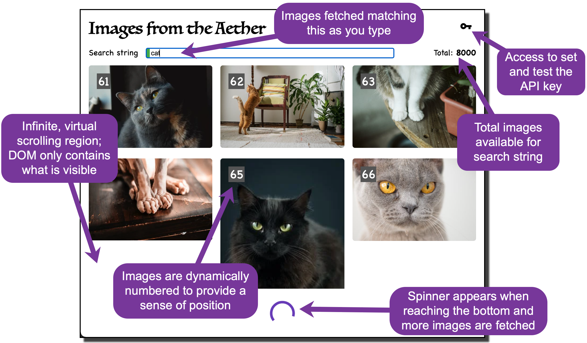

# Images From the Aether

## Purpose

"Images from the Aether" is a cloud image viewer web application.
There are plenty of image viewers out there, of course.
And, in fact, I did not sit down to create one.
What I wanted to do was create a modern web app from scratch using best design principles and practices
as a showcase piece for my portfolio.

So this is a real, working web app; not a toy or demo.

These are the high-level requirements:

- Display a photo collection keyed off a user-specified string.
- Have a search bar that responds as the user types.
- Retrieve photos from the Pexels API.
- Display results in a responsive grid.
- Use infinite scroll.
- Open an enlargement of a photo (and include the author's name) by clicking on one in the results.
- Image should be downloadable from that detail modal.

That leaves a variety of details unspecified, of course.
What I wanted to do was a clean TDD design so that, at the end, the unit tests itemize low-level requirements, providing a complete contract of the application's behavior -- guaranteed to be an accurate list of requirements as long as the tests pass!

## The Design and the Result

What is the quickest way for you, the reader, to understand what this application does, down to every nitty gritty detail?
Sure you could read the code but it is quite a leap from that to really knowing what the app does.
Or you could run the code--but you really would not know how to exercise everything that the app does.
Better than either of those: come with me as I describe the behavior to you -- through unit tests (and pictures).

### User Input

Let us begin with the user input. I want to let the user type anything, except that leading and/or trailing whitespace should be ignored.
But that means I need to also make sure that whitespace elsewhere is still preserved, and other special characters (e.g. punctuation) are also preserved. This set of tests covers all those:

```text
Section: AppComponent >> user input >> normalizing input
• leading and trailing whitespace in user input ignored
• leading whitespace in user input ignored
• trailing whitespace in user input ignored
• user input used verbatim when no whitespace present
• intermediate whitespace in user input is preserved
• special characters used verbatim
```

### Acting on User Input

Now as the user types, I want to respond briskly, to fetch matching photos. So I want to react to every keystroke, yes, but only when the user pauses, say after a "debounce period" of 400 milliseconds.

```text
Section: AppComponent >> user input >> react to keystrokes
• images are fetched on every keystroke (after debounce period)
• images are NOT fetched if debounce period has not expired
• images are NOT fetched when input is empty
```

### Fetching Results

Once that debounce period has elapsed, we call the API to fetch the first batch of photos.
Here is a typical screen showing the input and output so far.
Each image is annotated with an index number to give you a better sense of where you are in the results as you scroll.
Only a small number of images are fetched at a time; as you near the bottom of the scroll region, another batch is fetched.



Subsequent batches are fetched automatically as the user scrolls to the end of previous batch in the virtual scroll container.
As the user scrolls, events are emitted and observed.
Only when an event corresponds to the last photo of the previous batch do we fetch more.
Which means there are a variety of times that we do _not_ fetch more. Here are the tests:

```text
Section: ViewPhotosComponent >> with mock API >> fetching more photos during scrolling
• more photos are fetched when final photo is encountered
• more photos are NOT fetched when any non-final photo is encountered
• more photos are NOT fetched when initializing event triggers
• more photos are NOT fetched when end of input reached
• more photos are NOT fetched while still loading previous batch
```

When the user has scrolled to the bottom and a request for more photos is initiated, the next batch will arrive after some short delay based on the user's internet connection speed. That interval may be imperceptibly short... or it may not.
While loading, then, it is helpful to have a visual cue -- a spinner -- to let the user know loading is in progress.
Also, once the final batch of photos arrives, it is useful to have a visual cue indicating the end has been reached.
This set of test verifies both those visual cues:

```text
Section: ViewPhotosComponent >> with mock API >> status indicators
• displays end marker when collection exhausted (logic)
• displays end marker when collection exhausted (rendering)
• displays spinner while fetching photos
```

Here is a close up of the end marker (in the same location as the spinner).


With a collection of results to view, one can select any image to open a detail view, showing
an enlargement of the selected photo along with some details of the photograph, as detailed by these tests:

```text
Section: ViewPhotosComponent >> with modal component >> detail view
• signals modal to open when user selects an image
• renders larger image of selected photo in modal
• renders author of photo's name in modal
• renders link to author enclosing the name
• link to author will open in a new tab (or window)
```

A typical representation:


### Variations on a Result

Seeing a collection of photos is ultimately what a user is after when using this application.
But there are several other things the user might see depending on circumstances.

(1) When first opening up the app, nothing has been searched for so clearly there can be no results to display.
Instead, the user will see the no-search-started graphic, a sugar-coated image that conveys the "start here" message.

(2) while the available collection of images is vast it is not limitless so it is possible that no images are found to match what the user types.
In that event, the no-results graphic appears.

(3) In order to access the photo collection, one has to have a valid access key (discussed further next).
If the key is not valid and one asks for some images, the unauthorized graphic appears.

(4) Inevitably there are other assorted error circumstances, including no internet connection, server limit exceeded, and countless others.
For any of these unexpected errors a general-error graphic appears.

Here are thumbnails of those four displays:


The set of unit tests below confirm each of those images appears at the correct time.
Additionally, there is a final test that confirms that none of those images appear while a loading operation is ongoing.

```text
Section: ViewPhotosComponent >> with spy API >> result graphics
• displays no-search-started graphic with no input
• displays no-results graphic with some input but no results
• displays unauthorized graphic for authorization failure
• displays note for authorization failure
• displays general-error graphic for NON-authorization failure
• displays error code and message for NON-authorization failure
• does not display any graphic while loading
```

### API Access

As mentioned just above, the application requires an access key to obtain results from the Pexels API.
While I could have hard-wired a single access key that everyone who downloaded the app would use, I thought it would yield a more interesting design by thinking about that API key as credentials for the application itself and, as such, it would not be overly burdensome to require each user to obtain and register their own key with the app.
Thus, upon startup the first thing that occurs is a check for a stored key; if not found, it pops up a modal asking the user to supply one.
That same modal may be re-opened at any time by selecting the key icon in the upper right corner of the display.


These unit tests elaborate on the opening behavior of the modal for the API key:

```text
Section: AppComponent >> API key
• at startup, retrieves the previously saved user-entered key from browser local storage
• opens the key-entering modal automatically when no key found stored
• does NOT open the key-entering modal automatically when key is found stored
• opens the key-entering modal manually by clicking on the key icon
• stores the user-entered key in browser local storage
```

That deceptively simple modal has a number of behaviors to provide a useful user experience.
The illustration (my naive attempt at creating a [kineograph](https://en.wikipedia.org/wiki/Flip_book)) and the unit tests following provide the complete story.


```text
Section: AppComponent >> key modal
• has an input field to enter the key
• has buttons to save and to test the key
• buttons are initially disabled
• buttons reacts to presence of input
• test button has status indicators that are initially hidden
• test button reveals only spinner when API operation is in progress
• test button reveals only success indicator when API reports success
• test button reveals only failure indicator when API reports failure
• test button is disabled while test operation is in progress
• test button is NOT disabled when test operation completes
```

### The Base Modal Component

Both the modal for the API key and the modal for the detail image view are using the same component, the BaseModalComponent,
which provides its own inherent behaviors to any consumers:

```text
Section: BaseModalComponent
• modal opens on demand
• modal can be closed on demand
• modal closes itself upon pressing "escape"
• modal does NOT close upon pressing keys other than "escape"
• modal closes itself when clicking the background
• modal does NOT close when clicking deeper inside the modal body
• modal does NOT close when clicking the modal body
```

### State Management

I am using [@ngxs/store](https://github.com/ngxs/store#readme) for the first time with this project, having previously been an avid [@ngrx/store](https://github.com/ngrx/platform#readme) user.
Both of these provide a powerful state management system based on Redux for use in Angular applications.

I came across ngxs recently in my search for a way to do reduce the boilerplate needed by ngrx.
You can compare and contrast the two systems on [npmcompare.com](https://npmcompare.com/compare/@ngrx/store,@ngxs/store) and [npmtrends.com](https://www.npmtrends.com/@ngrx/store-vs-@ngxs/store).
They both work on the same principles: you dispatch an action, that action causes side effects, the store gets updated from those side effects, and ultimately subscribers watching specific portions of the store render responses to those state changes in the UI.

There are two actions used by this simple application:

**SetSearchString** is called every time the user modifies the search string at the top of the application window (but after the debounce period, that is).
It clears out the prior results, if any, and then stores the new string in the state.
The ViewPhotosComponent watches for changes to that particular piece of the state.
When it sees a new value, it invokes the next action, Fetch Photos.

**FetchPhotos** is invoked by either the presence of a new search string initiated by SetSearchString or by the user scrolling to the last photo of the prior results. Either way, it liaises with the ImageService to fetch more data from the Pexels API.
Once that new data is received, it determines whether it is the final batch or not (to set the end flag), and it adds a relative index number to each received photo so that can be displayed along with the photo in the UI.

```text
Store actions >> SetSearchString action
• resets page counter to zero
• puts search string into state
• resets photos to empty list
Store actions >> FetchPhotos action
• end of input reflects in state with value 'true'
• end of input reflects in state with value 'false'
• annotates photos with sequence number
• stores new photos in state
• increments page number with each subsequent fetch
```


The place to see that
(a) the above high-level requirements are all met, and (b) the choices for low-level requirements,
are in the unit tests.
The unit tests provide a thorough contract of low-level requirements -- guaranteed to be
accurate as long as the tests pass!

Unit tests cover all behaviors (what the code does) but also verify dynamic UI elements (when a button is disabled, when an indicator appears, etc.).

Unit tests do NOT cover the actual look of the UI (where a button or field is positioned on the page, alignment of elements, etc.). Also unit tests do not cover performance.

### Unit Tests as Low-Level Requirements
For convenience, here is a static snapshot of all the unit tests as of 2021.08.13:

...

The above set of unit tests tests the components:

- The AppComponent is the main component; it manages a key for the API Calls, as well as the user input.
- The ViewPhotosComponent houses the collection of photos in an infinite scroll region. It provides several visual cues (no search started, no results found, end of results reached, fetch in progress), along with providing a modal to show details of a selected image.
- The BaseModalComponent is a generic modal component that can be customized by providing content. It is used both to display image details (larger image, author, download link) and for prompting the user for an initial API key.


## Default Generated Docs for this Project

This project was generated with [Angular CLI](https://github.com/angular/angular-cli) version 11.2.6.

### Development server

Run `ng serve` for a dev server. Navigate to `http://localhost:4200/`. The app will automatically reload if you change any of the source files.

### Code scaffolding

Run `ng generate component component-name` to generate a new component. You can also use `ng generate directive|pipe|service|class|guard|interface|enum|module`.

### Build

Run `ng build` to build the project. The build artifacts will be stored in the `dist/` directory. Use the `--prod` flag for a production build.

### Running unit tests

Run `ng test` to execute the unit tests via [Karma](https://karma-runner.github.io).

### Running end-to-end tests

Run `ng e2e` to execute the end-to-end tests via [Protractor](http://www.protractortest.org/).

### Further help

To get more help on the Angular CLI use `ng help` or go check out the [Angular CLI Overview and Command Reference](https://angular.io/cli) page.
