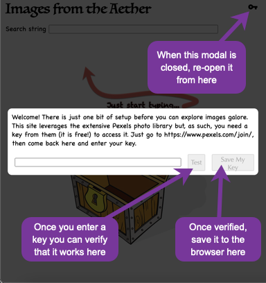

# Images From the Aether

## Purpose

"Images from the Aether" is a cloud image viewer web application. What, another one?
There are plenty of image viewers out there, of course.
And, in fact, I did not sit down to create one.
What I wanted to do was create a modern web app from scratch using best design principles and practices
as a showcase piece for my portfolio.
And this seemed like a project that was small enough to make it the amount of code easy to digest for a reader, yet still require quite a bit of different patterns, interfaces, and libraries to make it interesting.

So, yes, this is a real, working web app; not a toy or demo.

These are the high-level requirements I began with:

- Display a photo collection keyed off a user-specified string.
- Have a search bar that responds as the user types.
- Retrieve photos from the Pexels API.
- Display results in a responsive grid.
- Use infinite scroll.
- Open an enlargement of a photo (and include the author's name) by clicking on one in the results.
- Image should be downloadable from that detail modal.

That leaves a large number of details unspecified, of course.
What I wanted to do was a clean TDD design so that, at the end, the unit tests itemize low-level requirements, providing a contract of the application's behavior -- guaranteed to be an accurate list of requirements as long as the tests pass!

My end result was a thorough but not quite complete list.
There are some things not really amenable to unit tests: accessibility, performance, responsiveness of the display, visual positioning (where a button or field is positioned on the page, alignment of elements, etc.), and probably a few others.

## Using the Application

You can certainly clone the repository and play with this application on your own machine, or you can just launch it immediately in your browser at https://msorens.github.io/images-from-the-aether/, courtesy of [GitHub Pages](https://pages.github.com/).
Be advised, however, that you will need a Pexels API key to do anything (see _API Access_ below for further details).

## The Design and the Result

What is the quickest way for you, the reader, to understand what this application does, down to every nitty gritty detail?
Sure you could read the code but it is quite a leap from that to really knowing what the app does.
Or you could run the code--but you really would not know how to exercise everything that the app does.
Better than either of those: come with me as I describe the behavior to you -- through unit tests (and pictures).

### Overview

There are just three components...

- The `AppComponent` (the main component) manages a key for the API Calls, as well as the user input.
- The `ViewPhotosComponent` houses the collection of photos in an infinite scroll region. It provides several visual cues (no search started, no results found, end of results reached, fetch in progress), along with providing a modal to show details of a selected image.
- The `BaseModalComponent` is a generic modal component that can be customized by providing content. It is used both to display image details (larger image, author, download link) and for prompting the user for an initial API key.

...and two services:

- `ImageService` manages the API calls to test the API key and to load batches of photos.
- `KeyService` manages storing and retrieving the API key in your browser's local storage.

Next let us walk through the tests.

### User Input

Starting with the user input, I want to let the user type anything, except that leading and/or trailing whitespace should be ignored.
But that means I need to also make sure that whitespace elsewhere is still preserved, and other special characters (e.g. punctuation) are also preserved. This set of tests covers all those:

```text
Section: AppComponent >> user input >> normalizing input
• leading and trailing whitespace in user input ignored
• leading whitespace in user input ignored
• trailing whitespace in user input ignored
• user input used verbatim when no whitespace present
• intermediate whitespace in user input is preserved
• special characters used verbatim
```

### Acting on User Input

As the user types I want to respond briskly, to fetch matching photos. So I want to react to every keystroke, yes, but only when the user pauses, say after a "debounce period" of 400 milliseconds.

```text
Section: AppComponent >> user input >> react to keystrokes
• images are fetched on every keystroke (after debounce period)
• images are NOT fetched if debounce period has not expired
• images are NOT fetched when input is empty
```

### Fetching Results

Once that debounce period has elapsed, we call the API to fetch the first batch of photos.
Here is a typical screen showing the input and output so far.
Each image is annotated with an index number to give you a better sense of where you are in the results as you scroll.
Only a small number of images are fetched at a time; as you near the bottom of the scroll region, another batch is fetched.


Subsequent batches are fetched automatically as the user scrolls to the end of the previous batch in the virtual scroll container.
This occurs by observing the events that are emitted as the user scrolls.
Only when an event corresponds to the last photo of the previous batch do we fetch more.
Which means there are a variety of times that we do _not_ fetch more. Here are the tests:

```text
Section: ViewPhotosComponent >> with mock API >> fetching more photos during scrolling
• more photos are fetched when final photo is encountered
• more photos are NOT fetched when any non-final photo is encountered
• more photos are NOT fetched when initializing event triggers
• more photos are NOT fetched when end of input reached
• more photos are NOT fetched while still loading previous batch
```

When the user has scrolled to the bottom and a request for more photos is initiated, the next batch will arrive after some short delay based on the user's internet connection speed, machine load, etc.
That interval may be imperceptibly short... or it may not.
While loading, then, it is helpful to have a visual cue -- a spinner -- to let the user know loading is in progress.
Also, once the final batch of photos arrives, a visual cue indicating the end has been reached is handy.
This set of test verifies both those visual cues:

```text
Section: ViewPhotosComponent >> with mock API >> status indicators
• displays end marker when collection exhausted (logic)
• displays end marker when collection exhausted (rendering)
• displays spinner while fetching photos
```

Here is a close up of the end marker (in the same location as the spinner).


With a collection of results to view, one can select any image to open a detail view, showing
an enlargement of the selected photo along with some details of the photograph, as detailed by these tests:

```text
Section: ViewPhotosComponent >> with modal component >> detail view
• signals modal to open when user selects an image
• renders larger image of selected photo
• author name
  • enclosed with link to author details
  • renders with detail view
  • author link will open in a new tab (or window)
• save button
  • downloads image file URL when clicked
  • renders with detail view
  • displays download icon from material icons
• save button tooltip displays filename
  • for domain + only file + extension
  • for domain + only file + NO extension
  • for domain + path + file
  • for domain + path + file with spaces
  • exception: handles empty path gracefully with empty string
  • exception: handles empty url gracefully with empty string
  • exception: handles invalid url gracefully with empty string
```

A typical representation:


### Variations on a Result

Seeing a collection of photos is ultimately what a user is after when using this application.
But there are several other things the user might see depending on circumstances.

(1) When first opening up the app, nothing has been searched for so clearly there can be no results to display.
Instead, the user will see the no-search-started graphic, a cute-ish image that conveys the "start here" message.

(2) While the available collection of images is vast it is not limitless so it is possible that no images are found to match what the user types.
In that event, the no-results graphic appears.

(3) In order to access the photo collection, one has to have a valid access key (discussed in the next section).
If the key is not valid and one asks for some images, the unauthorized graphic appears.

(4) Inevitably there are other assorted error circumstances, including no internet connection, server limit exceeded, etc.
For any of these unexpected errors a general-error graphic appears.

Here are thumbnails of those four displays:


The set of unit tests below confirm each of those images appears at the correct time, only one ever occurs at a time, and none appear while loading is ongoing.

```text
Section: ViewPhotosComponent >> with spy API >> result graphics
• displays no-search-started graphic with no input
• displays no-results graphic with some input but no results
• displays unauthorized graphic for authorization failure
• displays note for authorization failure
• displays general-error graphic for NON-authorization failure
• displays error code and message for NON-authorization failure
• displays general-error graphic for empty response
• displays "empty response" for empty response
• does not display any graphic while loading
```

### API Access

As mentioned in the last section, the application requires an access key to obtain results from the Pexels API.
While I could have hard-wired a single access key that would be used by everyone who downloaded the app, I thought it would yield a more interesting design by thinking about that API key as credentials for the application itself and, as such, it would not be overly burdensome to require each user to obtain and register their own key with the app.
Thus, upon startup the first thing that occurs is a check for a stored key; if not found, it pops up a modal asking the user to supply one.



That same modal may be re-opened at any time by selecting the key icon in the upper right corner of the display.

These unit tests elaborate on the opening behavior of the modal for the API key:

```text
Section: AppComponent >> API key
• at startup, retrieves the previously saved user-entered key from browser local storage
• stores the user-entered key in browser local storage
• key-entering modal opening
  • opens automatically when no key found stored
  • does NOT open automatically when key is found stored
• button to re-open key modal
  • has label with key icon from material icons
  • includes tooltip
  • renders on main window
  • opens the key-entering modal manually when clicked
```

That deceptively simple modal has a number of behaviors to provide a useful user experience.
The illustration (my naive attempt at creating a [kineograph](https://en.wikipedia.org/wiki/Flip_book)) and the unit tests following provide the complete story.


```text
Section: AppComponent >> key modal
• has an input field to enter the key
• has buttons to save and to test the key
• buttons are initially disabled
• buttons reacts to presence of input
• test button has status indicators that are initially hidden
• test button reveals only spinner when API operation is in progress
• test button reveals only success indicator when API reports success
• test button reveals only failure indicator when API reports failure
• test button is disabled while test operation is in progress
• test button is NOT disabled when test operation completes
```

### The Base Modal Component

Both the modal for the API key and the modal for the detail image view are using the same component, the `BaseModalComponent`.
This component opens a dialog that appears to be on top of the main window, greys out the contents of that main window, and only allows actions within the dialog.

The inherent behaviors of this modal component available to any consumer component are covered by these tests:

```text
Section: BaseModalComponent
• modal opens on demand
• modal can be closed on demand
• modal closes itself upon pressing "escape"
• modal does NOT close upon pressing keys other than "escape"
• modal closes itself when clicking the background
• modal does NOT close when clicking deeper inside the modal body
• modal does NOT close when clicking the modal body
```

### State Management

I am using [@ngxs/store](https://github.com/ngxs/store#readme) for the first time with this project, having previously been an avid [@ngrx/store](https://github.com/ngrx/platform#readme) user.
Both of these provide a powerful state management system based on Redux for use in Angular applications.

I came across ngxs recently in my search for a way to do reduce the boilerplate needed by ngrx.
You can compare and contrast the two systems on [npmcompare.com](https://npmcompare.com/compare/@ngrx/store,@ngxs/store) and [npmtrends.com](https://www.npmtrends.com/@ngrx/store-vs-@ngxs/store).
They both work on the same principles: you dispatch an action, that action causes side effects, the store gets updated from those side effects, and ultimately subscribers watching specific portions of the store render responses to those state changes in the UI.

There are two actions used by this simple application:

`SetSearchString` is called every time the user modifies the search string at the top of the application window (after the debounce period, discussed earlier).
It clears out the prior results, if any, and then stores the new string in the state.
The ViewPhotosComponent watches for changes to that particular piece of the state.
When it sees a new value, it invokes the next action, `FetchPhotos`.

`FetchPhotos` is invoked by either the presence of a new search string initiated by `SetSearchString` or by the user scrolling to the last photo of the prior results.
Either way, it liaises with the `ImageService` to fetch more data from the Pexels API.
Once that new data is received, it determines whether it is the final batch or not (to set the end flag), and it adds a relative index number to each received photo so that can be displayed along with the photo in the UI.

```text
Store actions >> SetSearchString action
• resets page counter to zero
• puts search string into state
• resets photos to empty list
Store actions >> FetchPhotos action
• end-of-input
  • end of input reflects in state with value 'true'
  • end of input reflects in state with value 'false'
• annotates photos with sequence number
• stores new photos in state
• increments page number with each subsequent fetch
```

## More On Managing Search Results

The heart of this application is managing a potentially huge collection of images.
Searching for `cat`, for example, yields 8000 results.
The idea is to only fetch a small batch at a time, and as the user scrolls down, another batch is fetched, then another, etc.
The user can thus scroll through those 8000 images seamlessly.
This is the notion of [infinite scrolling](https://builtin.com/ux-design/infinite-scroll).

But if all those images were kept in memory, batch after batch, the browser would start to bog down and exhibit poor performance.
So the app then needs [virtual scrolling](https://dev.to/adamklein/build-your-own-virtual-scroll-part-i-11ib) as well.
With a virtual scrolling container, the app renders just the very small number of items that happen to be on screen at a given moment (plus a few above and below that to allow for smooth transitions).

There are numerous scrolling libraries available that support either or both of those -- but mostly for a simple, one-dimensional list.
For this app, we need a two-dimensional grid of images that can be used with virtual infinite scrolling.
Because the grid has multiple tiles across the page, it is important for the app to also support [responsive design](https://developer.mozilla.org/en-US/docs/Learn/CSS/CSS_layout/Responsive_Design), meaning it adjusts the layout to accommodate whatever screen size and resolution the user is using.
Practically speaking, it should adjust the number of images across the page depending on the screen width.
And that is not just at page load time--if the user changes the window size, the layout should react accordingly.

With those aspirations in mind, I went looking for an off-the-shelf component:

- Angular's own `<cdk-virtual-scroll-viewport>`, detailed in this great article from [Zoaib Khan](https://zoaibkhan.com/blog/create-a-fast-infinite-scrolling-list-in-angular/). Main problem with this approach: supports list only, not a grid.

- `ngx-infinite-scroll` directive, detailed here by [Christian Nwamba](https://blog.ag-grid.com/implementing-infinite-loading-in-an-angular-store-application/). Main problem: infinite but not virtual scroll, so it keeps adding to the DOM.

- `<virtual-scroller>` (ngx-virtual-scroller) from [Rinto Jose](https://github.com/rintoj/ngx-virtual-scroller).  Main problem: not responsive to window size changes.

- `<od-virtualscroll>` from [Onur Doğangönül](https://github.com/dinony/od-virtualscroll).
Main problem: difficulty getting it running on my machine

During my search for a good solution I had some useful conversations with some of the folks who have worked on this problem.
A special kudos in particular to Zoaib Khan, who critiqued and tweaked code to help me get things going.
Zoaib provided yet further assistance from his article, [Fastest way to make a responsive card grid with CSS](https://zoaibkhan.com/blog/fastest-way-to-make-a-responsive-card-grid-with-css/), revealing an elegant CSS technique to add responsiveness to existing layout!

## Further Points on Maintainable Design

### Clean Unit Tests

I wanted the unit tests to be "short and sweet" and follow the useful Arrange-Act-Assert pattern; ideally just a couple lines for each.
As many of my tests were peeking at the DOM, I crafted a set of helpers in queryHelper.ts to facilitate this.

In this example, you can see how the `findAs` and `findAllAs` generic helper functions make the test almost trivial.
I first do a sanity check that the input field is empty.
The standard DOM query returns a generic `HTMLElement`, which does not have a `value` property.
So instead of just doing a `find` I use `findAs` to cast it to an `HTMLInputElement` in order to access its `value`.
I then do a `findAllAs` to find a set of buttons and confirm they are all disabled (which similarly needs each object to be an `HTMLButtonElement`).

```typescript
    it('buttons are initially disabled', () => {
      fixture.detectChanges();
      expect(findAs<HTMLInputElement>('.control-bar input').value).toBe('');

      findAllAs<HTMLButtonElement>('.control-bar button')
        .forEach(button => {
          expect(button.disabled).toBeTrue();
        });
    })
```

### Accessibility

The UI is rather simple so there is not much explicit accessibility support needed, besides well-structured HTML.
About the only thing I needed to add was the appropriate `<label>` element on inputs, e.g.,

```html
<label for="searchString">Search string</label>
```

### Entities are treated as entities, not strings

Often when writing a program we need to deal with a thing that has a well-defined structure: a bit of HTML or XML, a URL, an entry in a log file, etc.
Since each of those is typically supplied as a string it is only natural that the developer treats them as strings.
But that can lead to what I call the "subtle syntax catastrophe" which I talk about in my article [Code Smells: Raw Strings and the Subtle Syntax Catastrophe](https://www.red-gate.com/simple-talk/development/dotnet-development/code-smells-raw-strings-subtle-syntax-catastrophe/).
For the case at hand, I had a need to extract the file name out of a URL.
It is fairly straightforward to find the piece of string between the first virgule and question mark, and know that that is the path to the file, so the name of the file is the last piece on that path.
But that is dealing with the URL as a raw string, and there is no benefit to that.
Rather, treat it as a URL: create a first-class URL object and then just access the `pathname` property to get that file path.
You can see this in action in `view-photos.component.ts::getFileName()`.

### Unit Tests Are Phantom-Aware

Perhaps there is a industry term for this, but I have coined the phrase "phantom tests" in my article
[The Phantom Menace in Unit Testing](https://www.red-gate.com/simple-talk/dotnet/software-testing/the-phantom-menace-in-unit-testing/).
A phantom test is one that proves nothing because if the code under test *did nothing*, the result would be the same.
I give a mention to this in base-modal.component.spec.ts.

### CSS Constants

Native CSS does not support reusable variables or constants: if you want to reuse a number in multiple places, you just repeat that hard-coded value over and over and...
Fortunately, SASS does support constants (except they call them variables ;-).
The few global values I needed are recorded only once in _variables.scss and those named constants can then be used freely without any maintenance burden.

### On File Downloads

Such a simple notion; such a challenge to do in an in-browser application!

In the early days, in-browser code could not interact with the filesystem for security reasons.
With the advent of HTML 5, however, a simple mechanism was introduced to allow downloading a file,
using the `download` attribute in an anchor element:

```html
    <a href='TARGET_URL' download='image.jpg'>Download</a>
```

Initially that worked, but then--again for security reasons--the `download` attribute
became ignored for cross-origin URLs (reference:
https://developers.google.com/web/updates/2018/02/chrome-65-deprecations#block_cross-origin_a_download).
Patterns emerged to download the file in question asynchronously, then feed it to an anchor element so as not to violate the CORS constraint.
One way is using the built-in `fetch` method (from https://dev.to/sbodi10/download-images-using-javascript-51a9):

```javascript
  const image = await fetch(remoteUrl)
  const imageBlog = await image.blob()
  const imageURL = URL.createObjectURL(imageBlog)
  // ... pass it to a generated anchor element
```

Alternately, the axios library provides a slightly more convenient way to retrieve the remote data
(from https://www.delftstack.com/howto/javascript/javascript-download/#use-axios-library-to-download-files):

```javascript
  axios({
        url: remoteUrl,
        method: 'GET',
        responseType: 'blob'
  })
  .then((response) => {
    // ... pass it to a generated anchor element
  }
```

Either way, after retrieving the data, it would be fed to an anchor element and one would then manually
trigger  the link by invoking its `click` method.
That one has to trigger the browser to do a file download via the DOM rather than writing code to do it directly seemed rather peculiar to me.
Looking further it turns out that a new native file system API was very recently developed--but alas, at the time of writing (September 2021) it is so new that it is barely supported
(references: Can I Use data at https://caniuse.com/native-filesystem-api and
 Draft Report on File System Access dated August 2021 at https://wicg.github.io/file-system-access/).

As all the workarounds seemed somewhat kludgy I opted to just use the [file-saver](https://www.npmjs.com/package/file-saver) library, which could do the whole operation in a single line of code ( see `view-photos.component.ts::download()` ).

### More on File Downloads

Yes, there is still more to say on this topic.
My initial thought was, like a desktop application, when the user selects to download something, they are then presented with a file picker dialog, allowing specifying the directory path and the file name through OS-specific design standards.
It turns out that displaying such a file picker though is again a large challenge; the self-same native file system API mentioned above will eventually allow that.
Today, it is so much simpler to just let the browser "do its thing": when you select something to download it puts it in the "downloads" folder.
If a file of the same name already exists, the browser intelligently starts adding sequence numbers.
On a Mac, for instance, Chrome saves "image.jpg", "image (1).jpg", "image (2).jpg", etc., whereas Firefox does the same thing sans the space character: "image.jpg", "image(1).jpg", "image(2).jpg", etc.

### Beyond Breadth: Unit Tests have Depth

Code coverage is a great metric for unit tests.
One should always strive for a high percentage; just what that percentage should be (80, 90, 100??) is open for debate, but picking any reasonably high number is better than not.
However, that metric only covers breadth of tests.
Just as important is the aspect of depth--that is all about the two-pronged approach of boundary-value analysis and equivalence class partitioning.
I talk about those in detail in the *Test Quality* section of my article [Go Unit Tests: Tips from the Trenches](https://www.red-gate.com/simple-talk/devops/testing/go-unit-tests-tips-from-the-trenches/).
As mentioned there, data-driven tests provide a good way to achieve depth.
One example of that approach to deep tests is in the "normalizing input" section in app.component.spec.ts.
But test depth can also come from a series of related tests covering the same topic.
If you look above at the set of tests under the heading "fetching more photos during scrolling" you will find one test that checks for when more photos are fetched, plus several related tests where more photos are *not* fetched.
You can peruse all the depth coverage tests in this test suite by searching for "(DEPTH COVERAGE)".

### Strict Mode and Other Checks

I am an ardent believer in using safety nets whenever possible--let the machine do the work of checking rote things!
First and foremost, the TypeScript compiler offers a **strict** mode (in tsconfig.json) which is a composite of several important checks.
I am firmly of the opinion that one should never build a project without it.
The cost of finding errors grows exponentially as a project develops so if one can flip a switch to catch errors earlier, that is a definite win!

I further rely on whatever linters I can find: one for TypeScript, of course, but there is even a linter for markdown files (such as the one you are reading) called [Markdown Lint](https://marketplace.visualstudio.com/items?itemName=DavidAnson.vscode-markdownlint), which helped me construct this file properly.

I use a spell-checker for my code, too ([Code Spell Checker](https://marketplace.visualstudio.com/items?itemName=streetsidesoftware.code-spell-checker)).
That not only helps prevent embarrassing typos being shown to all your users, but it also occasionally resolves code bugs--there are almost always bits of an application that rely on data names that the compiler just cannot validate a priori, and if you mistype one you have a problem.

### TypeScript Type Traps

To say that TypeScript boosts JavaScript development to great heights cannot be overstated.
But strong-typing is not a panacea; it is a tool that must be used with care.
Sometimes it can even fool you: my canonical example is that if you use type assertions incorrectly you actually get weaker code!
See my slide deck [TypeScript Type Traps](https://docs.google.com/presentation/d/1ir7P7V0tzO4cd4vCtyUb-a5fHFnBsRYTUoCWLq6xksU/edit#slide=id.g5e2880a3d6_0_78) where I explain that and a few other vagaries of the language.

### Unit Tests Test Behavior Rather than Implementation

Testing behavior in unit tests is much more robust and much more interesting than testing implementation.
It is more robust because testing behavior allows you to change the implementation if desired and still have all the tests pass without having to rewrite any.
And it is much more interesting because behavior-oriented tests describe to any interested code readers something tangible, some actual behavior that the code performs, as opposed to, say, showing that some internal function with inputs `x` and `y` returns `z`.

## Default Generated Docs for this Project

This project was generated with [Angular CLI](https://github.com/angular/angular-cli) version 11.2.6.

### Development server

Run `ng serve` for a dev server. Navigate to `http://localhost:4200/`. The app will automatically reload if you change any of the source files.

### Code scaffolding

Run `ng generate component component-name` to generate a new component. You can also use `ng generate directive|pipe|service|class|guard|interface|enum|module`.

### Build

Run `ng build` to build the project. The build artifacts will be stored in the `dist/` directory. Use the `--prod` flag for a production build.

### Running unit tests

Run `ng test` to execute the unit tests via [Karma](https://karma-runner.github.io).

### Running end-to-end tests

Run `ng e2e` to execute the end-to-end tests via [Protractor](http://www.protractortest.org/).

### Further help

To get more help on the Angular CLI use `ng help` or go check out the [Angular CLI Overview and Command Reference](https://angular.io/cli) page.
