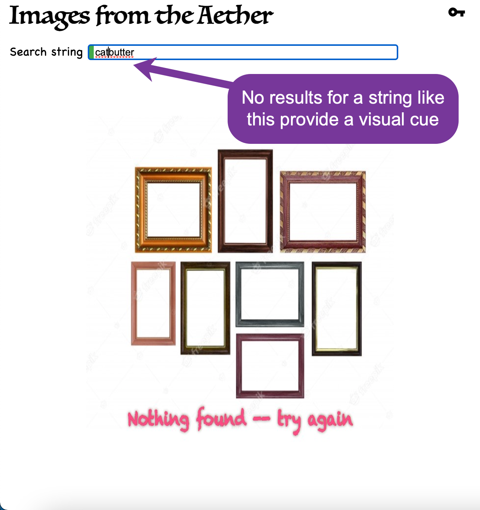

# Images From the Aether

## Purpose

This is a demo project (but not just a toy) to highlight my development skills for a real application.

The high-level requirements are just these:

- Display a photo collection keyed off a user-specified string.
- Search bar that responds as the user types.
- Images retrieved from the Pexels API.
- Results displayed in a responsive grid.
- Infinite scroll.
- Selecting an image opens a larger modal view of that image along with the author's name.
- Image should be downloadable from that detail modal.

### Unit Tests as Low-Level Requirements

That leaves a variety of details unspecified, of course. The place to see that
(a) the above high-level requirements are all met, and (b) the choices for low-level requirements,
are in the unit tests.
The unit tests provide a thorough contract of low-level requirements -- guaranteed to be
accurate as long as the tests pass!

Unit tests cover all behaviors (what the code does) but also verify dynamic UI elements (when a button is disabled, when an indicator appears, etc.).

Unit tests do NOT cover the actual look of the UI (where a button or field is positioned on the page, alignment of elements, etc.). Also unit tests do not cover performance.

For convenience, here is a static snapshot of all the unit tests as of 2021.08.13:

```text
AppComponent
  key modal
   • buttons reacts to presence of input
   • buttons are initially disabled
   • test button has status indicators that are initially hidden
   • has buttons to save and to test the key
   • has an input field to enter the key
   • test button reveals only spinner when API operation is in progress
   • test button reveals only success indicator when API reports success
   • test button reveals only failure indicator when API reports failure
  user input
   • trailing whitespace in user input ignored
   • no whitespace in user input used as is
   • leading and trailing whitespace in user input ignored
   • leading whitespace in user input ignored
   • images are fetched on every keystroke (after debounce period)
   • images are NOT fetched if debounce period has not expired
   • images are NOT fetched when input is empty
  general
   • should render heading
   • should create the app
  API key
   • at startup, retrieves the previously saved user-entered key from browser local storage
   • stores the user-entered key in browser local storage
   • pops up the key-entering modal when no key found stored
   • does NOT pop up the key-entering modal when key is found stored

ViewPhotosComponent
  default
   • more photos are NOT fetched while still loading previous batch
   • dispatch is invoked when more photos available
   • signals modal to open when user selects an image
   • more photos are NOT fetched when event is triggered by any other photo
   • more photos are NOT fetched when initializing event triggers
   • more photos are NOT fetched when end of input reached
  with mock API
   • displays end marker when collection exhausted (rendering)
   • more photos are fetched when event is triggered by final photo
   • displays spinner while fetching photos
   • displays end marker when collection exhausted (logic)
  with spy API
   • displays no-search-started-graphic with no input
   • does not display either empty graphic while loading
   • displays no-results-graphic with some input but no results
  with modal component
   • renders author of photo's name in modal
   • renders link to author enclosing the name
   • renders larger image of selected photo in modal

BaseModalComponent
 • modal does NOT close when clicking deeper inside the modal body
 • modal does NOT close when clicking the modal body
 • modal closes itself when clicking the background
 • modal can be closed on demand
 • should be created
 • modal closes itself upon pressing "escape"
 • modal does NOT close upon pressing keys other than "escape"
 • modal opens on demand

Store actions
  FetchPhotos action
   • end of input reflects in state with value 'false'
   • end of input reflects in state with value 'true'
   • increments page number with each subsequent fetch
   • annotates photos with sequence number
   • stores new photos in state
  SetSearchString action
   • puts search string into state
   • resets photos to empty list
   • resets page counter to zero
```

The above set of unit tests tests the components:

- The AppComponent is the main component; it manages a key for the API Calls, as well as the user input.
- The ViewPhotosComponent houses the collection of photos in an infinite scroll region. It provides several visual cues (no search started, no results found, end of results reached, fetch in progress), along with providing a modal to show details of a selected image.
- The BaseModalComponent is a generic modal component that can be customized by providing content. It is used both to display image details (larger image, author, download link) and for prompting the user for an initial API key.

The above unit tests also test the state management aspects:
I am using [@ngxs/store](https://github.com/ngxs/store#readme) for the first time with this project, having previously been an avid [@ngrx/store](https://github.com/ngrx/platform#readme) user.
I came across ngxs recently in my search for a way to do reduce the boilerplate necessary for ngrx.
The two systems can be compared and contrasted on [npmcompare.com](https://npmcompare.com/compare/@ngrx/store,@ngxs/store) and [npmtrends.com](https://www.npmtrends.com/@ngrx/store-vs-@ngxs/store).

## Using the Application

Let's take a step up now to see what the running application actually looks like.

Results are fetched as you type. Each image is annotated with an index number to give you a better sense of where you are in the results as you scroll. Only a small number of images are fetched at a time; as you near the bottom of the scroll region, more are fetched.


Once you reach the last group of images, you will see a visual cue at the bottom to let you know.


You can enlarge any image by selecting it; a details view opens in a modal window.


Initially -- when you have not asked for anything and no results are present -- you will see this friendly screen.


When you first start the application you need to provide a key to use the API.
If no key is yet detected it will prompt you to get, test, and save one.


If no results are found for your search string, you see this melancholy display:



## Default Generated Docs for this Project

This project was generated with [Angular CLI](https://github.com/angular/angular-cli) version 11.2.6.

### Development server

Run `ng serve` for a dev server. Navigate to `http://localhost:4200/`. The app will automatically reload if you change any of the source files.

### Code scaffolding

Run `ng generate component component-name` to generate a new component. You can also use `ng generate directive|pipe|service|class|guard|interface|enum|module`.

### Build

Run `ng build` to build the project. The build artifacts will be stored in the `dist/` directory. Use the `--prod` flag for a production build.

### Running unit tests

Run `ng test` to execute the unit tests via [Karma](https://karma-runner.github.io).

### Running end-to-end tests

Run `ng e2e` to execute the end-to-end tests via [Protractor](http://www.protractortest.org/).

### Further help

To get more help on the Angular CLI use `ng help` or go check out the [Angular CLI Overview and Command Reference](https://angular.io/cli) page.
